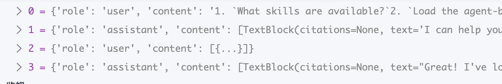

# s05: Skills (技能加载)

`s01 > s02 > s03 > s04 > [ s05 ] s06 | s07 > s08 > s09 > s10 > s11 > s12`

> *"用到什么知识, 临时加载什么知识"* -- 通过 tool_result 注入, 不塞 system prompt。

## 问题

你希望智能体遵循特定领域的工作流: git 约定、测试模式、代码审查清单。全塞进系统提示太浪费 -- 10 个技能, 每个 2000 token, 就是 20,000 token, 大部分跟当前任务毫无关系。

## 解决方案

```
System prompt (Layer 1 -- always present):
+--------------------------------------+
| You are a coding agent.              |
| Skills available:                    |
|   - git: Git workflow helpers        |  ~100 tokens/skill
|   - test: Testing best practices     |
+--------------------------------------+

When model calls load_skill("git"):
+--------------------------------------+
| tool_result (Layer 2 -- on demand):  |
| <skill name="git">                   |
|   Full git workflow instructions...  |  ~2000 tokens
|   Step 1: ...                        |
| </skill>                             |
+--------------------------------------+
```

第一层: 系统提示中放技能名称 (低成本)。第二层: tool_result 中按需放完整内容。

## 工作原理

1. 每个技能是一个目录, 包含 `SKILL.md` 文件和 YAML frontmatter。

```
skills/
  pdf/
    SKILL.md       # ---\n name: pdf\n description: Process PDF files\n ---\n ...
  code-review/
    SKILL.md       # ---\n name: code-review\n description: Review code\n ---\n ...
```

2. SkillLoader 递归扫描 `SKILL.md` 文件, 用目录名作为技能标识。

```python
class SkillLoader:
    def __init__(self, skills_dir: Path):
        self.skills = {}
        for f in sorted(skills_dir.rglob("SKILL.md")):
            text = f.read_text()
            meta, body = self._parse_frontmatter(text)
            name = meta.get("name", f.parent.name)
            self.skills[name] = {"meta": meta, "body": body}

    def get_descriptions(self) -> str:
        lines = []
        for name, skill in self.skills.items():
            desc = skill["meta"].get("description", "")
            lines.append(f"  - {name}: {desc}")
        return "\n".join(lines)

    def get_content(self, name: str) -> str:
        skill = self.skills.get(name)
        if not skill:
            return f"Error: Unknown skill '{name}'."
        return f"<skill name=\"{name}\">\n{skill['body']}\n</skill>"
```

3. 第一层写入系统提示。第二层不过是 dispatch map 中的又一个工具。

```python
SYSTEM = f"""You are a coding agent at {WORKDIR}.
Skills available:
{SKILL_LOADER.get_descriptions()}"""

TOOL_HANDLERS = {
    # ...base tools...
    "load_skill": lambda **kw: SKILL_LOADER.get_content(kw["name"]),
}
```

模型知道有哪些技能 (便宜), 需要时再加载完整内容 (贵)。

## 相对 s04 的变更

| 组件           | 之前 (s04)       | 之后 (s05)                     |
|----------------|------------------|--------------------------------|
| Tools          | 5 (基础 + task)  | 5 (基础 + load_skill)          |
| 系统提示       | 静态字符串       | + 技能描述列表                 |
| 知识库         | 无               | skills/\*/SKILL.md 文件        |
| 注入方式       | 无               | 两层 (系统提示 + result)       |

## 试一试

```sh
cd learn-claude-code
python agents/s05_skill_loading.py
```

试试这些 prompt (英文 prompt 对 LLM 效果更好, 也可以用中文):

1. `What skills are available?`
2. `Load the agent-builder skill and follow its instructions`
3. `I need to do a code review -- load the relevant skill first`
4. `Build an MCP server using the mcp-builder skill`

response 加载 skills 时的返回：
```json
{
    "id": "msg_01RKnKQPERcbPbZcF9PBx70i",
    "container": null,
    "content": [
        {
            "citations": null,
            "text": "I can help you with these tasks. Let me address each one:\n\n**1. Available skills:**\n- agent-builder\n- code-review: For thorough code reviews with security, performance, and maintainability analysis\n- mcp-builder: For building MCP (Model Context Protocol) servers that give Claude new capabilities\n- pdf: For processing PDF files - extract text, create PDFs, merge documents\n\n**2. Loading agent-builder skill:**",
            "type": "text"
        },
        {
            "id": "toolu_w9Y0VyQra6tLP3vLz5JIF3",
            "caller": null,
            "input": {
                "name": "agent-builder"
            },
            "name": "load_skill",
            "type": "tool_use"
        }
    ],
    "model": "claude-sonnet-4-6",
    "role": "assistant",
    "stop_reason": "tool_use",
    "stop_sequence": null,
    "type": "message",
    "usage": {
        "cache_creation": {
            "ephemeral_1h_input_tokens": null,
            "ephemeral_5m_input_tokens": 1100
        },
        "cache_creation_input_tokens": 1100,
        "cache_read_input_tokens": 0,
        "inference_geo": null,
        "input_tokens": 1,
        "output_tokens": 338,
        "server_tool_use": null,
        "service_tier": null,
        "claude_cache_creation_5_m_tokens": 0,
        "claude_cache_creation_1_h_tokens": 0
    }
}
```

加载完第一个 skill 后，claude 的返回：

```json
{
    "id": "msg_01lCpErnvOMHKv6NZwadISen",
    "container": null,
    "content": [
        {
            "citations": null,
            "text": "Great! I've loaded the agent-builder skill. Here's what it teaches:\n\n**Core Philosophy**: The model already knows how to be an agent - your job is to get out of the way. An agent is just a simple loop where the model sees context + capabilities, decides to act or respond, executes actions, and continues.\n\n**The Three Elements**:\n1. **Capabilities** - What can it DO? (3-5 atomic actions to start)\n2. **Knowledge** - What does it KNOW? (domain expertise loaded on-demand)\n3. **Context** - What has happened? (conversation history)\n\n**Key Principles**:\n- Start with 3-5 capabilities, add more only when needed\n- Trust the model to reason - don't over-engineer workflows\n- Load knowledge on-demand, not upfront\n- Keep context clean and focused\n\n**Progressive Complexity** (add only when needed):\n- Basic: 3-5 capabilities (always start here)\n- Planning: Progress tracking (for multi-step tasks)\n- Subagents: Isolated child agents (when exploration pollutes context)\n- Skills: On-demand knowledge (when domain expertise needed)\n\nThe skill includes references for implementation patterns, minimal agent examples, and scaffolding scripts.\n\n**For your other requests:**\n\n**3. Code review** - Ready to load the code-review skill when you need it.\n\n**4. MCP server** - Ready to load the mcp-builder skill when you want to build one.\n\nWhich would you like to tackle next?",
            "type": "text"
        }
    ],
    "model": "claude-sonnet-4-6",
    "role": "assistant",
    "stop_reason": "end_turn",
    "stop_sequence": null,
    "type": "message",
    "usage": {
        "cache_creation": {
            "ephemeral_1h_input_tokens": null,
            "ephemeral_5m_input_tokens": 2990
        },
        "cache_creation_input_tokens": 2990,
        "cache_read_input_tokens": 0,
        "inference_geo": null,
        "input_tokens": 1,
        "output_tokens": 1087,
        "server_tool_use": null,
        "service_tier": null,
        "claude_cache_creation_5_m_tokens": 0,
        "claude_cache_creation_1_h_tokens": 0
    }
}
```

这里就是整个消息列表，等待下一次用户输入：
